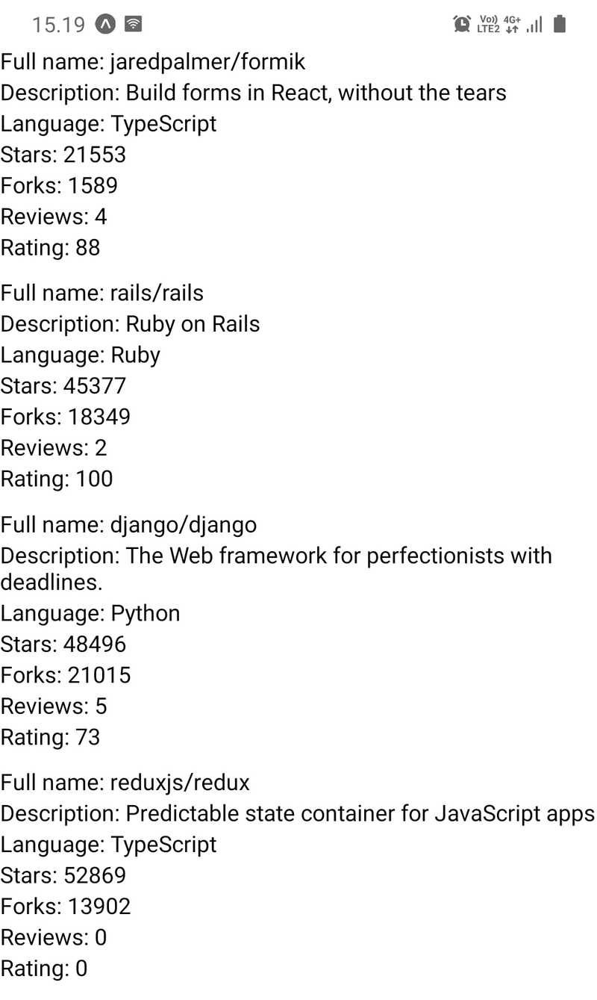

# This repository contains the Full Stack Open course part-10 exercises

All exercises are saved in a separate commit.

## Exercise 10.1: initializing the application

Initialize your application with Expo command-line interface and set up the development environment either using an emulator or Expo's mobile app. It is recommended to try both and find out which development environment is the most suitable for you. The name of the application is not that relevant. You can, for example, go with rate-repository-app.

To submit this exercise and all future exercises you need to [create a new GitHub repository](https://github.com/new). The name of the repository can be for example the name of the application you initialized with expo init. If you decide to create a private repository, add GitHub user [mluukkai](https://github.com/mluukkai) as a [repository collaborator](https://docs.github.com/en/account-and-profile/setting-up-and-managing-your-personal-account-on-github/managing-access-to-your-personal-repositories/inviting-collaborators-to-a-personal-repository). The collaborator status is only used for verifying your submissions.

Now that the repository is created, run `git init` within your application's root directory to make sure that the directory is initialized as a Git repository. Next, to add the created repository as the remote run `git remote add origin git@github.com:<YOURGITHUBUSERNAME>/<NAMEOFYOUR_REPOSITORY>.git` (remember to replace the placeholder values in the command). Finally, just commit and push your changes into the repository and you are all done.

## Exercise 10.2: setting up the ESLint

Set up ESLint in your project so that you can perform linter checks by running `npm run lint`. To get most of linting it is also recommended to integrate ESLint with your editor.

## Exercise 10.3: the reviewed repositories list

In this exercise, we will implement the first version of the reviewed repositories list. The list should contain the repository's full name, description, language, number of forks, number of stars, rating average and number of reviews. Luckily React Native provides a handy component for displaying a list of data, which is the [FlatList](https://reactnative.dev/docs/flatlist) component.

Implement components `RepositoryList` and `RepositoryItem` in the components directory's files _RepositoryList.jsx_ and _RepositoryItem.jsx_. The RepositoryList component should render the `FlatList` component and `RepositoryItem` a single item on the list (hint: use the `FlatList` component's [renderItem](https://reactnative.dev/docs/flatlist#required-renderitem) prop). Use this as the basis for the RepositoryList.jsx file:

```jsx
import { FlatList, View, StyleSheet } from 'react-native';

const styles = StyleSheet.create({
  separator: {
    height: 10,
  },
});

const repositories = [
  {
    id: 'jaredpalmer.formik',
    fullName: 'jaredpalmer/formik',
    description: 'Build forms in React, without the tears',
    language: 'TypeScript',
    forksCount: 1589,
    stargazersCount: 21553,
    ratingAverage: 88,
    reviewCount: 4,
    ownerAvatarUrl: 'https://avatars2.githubusercontent.com/u/4060187?v=4',
  },
  {
    id: 'rails.rails',
    fullName: 'rails/rails',
    description: 'Ruby on Rails',
    language: 'Ruby',
    forksCount: 18349,
    stargazersCount: 45377,
    ratingAverage: 100,
    reviewCount: 2,
    ownerAvatarUrl: 'https://avatars1.githubusercontent.com/u/4223?v=4',
  },
  {
    id: 'django.django',
    fullName: 'django/django',
    description: 'The Web framework for perfectionists with deadlines.',
    language: 'Python',
    forksCount: 21015,
    stargazersCount: 48496,
    ratingAverage: 73,
    reviewCount: 5,
    ownerAvatarUrl: 'https://avatars2.githubusercontent.com/u/27804?v=4',
  },
  {
    id: 'reduxjs.redux',
    fullName: 'reduxjs/redux',
    description: 'Predictable state container for JavaScript apps',
    language: 'TypeScript',
    forksCount: 13902,
    stargazersCount: 52869,
    ratingAverage: 0,
    reviewCount: 0,
    ownerAvatarUrl: 'https://avatars3.githubusercontent.com/u/13142323?v=4',
  },
];

const ItemSeparator = () => <View style={styles.separator} />;

const RepositoryList = () => {
  return (
    <FlatList
      data={repositories}
      ItemSeparatorComponent={ItemSeparator}
      // other props
    />
  );
};

export default RepositoryList;
```

_Do not_ alter the contents of the `repositories` variable, it should contain everything you need to complete this exercise. Render the `RepositoryList` component in the `Main` component which we previously added to the _Main.jsx_ file. The reviewed repository list should roughly look something like this:


