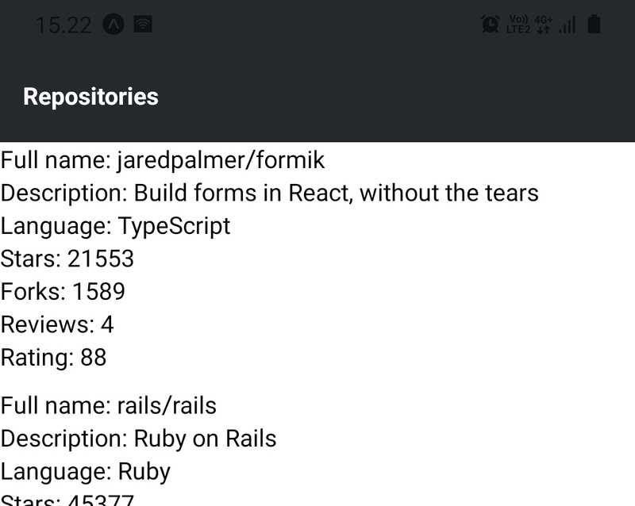
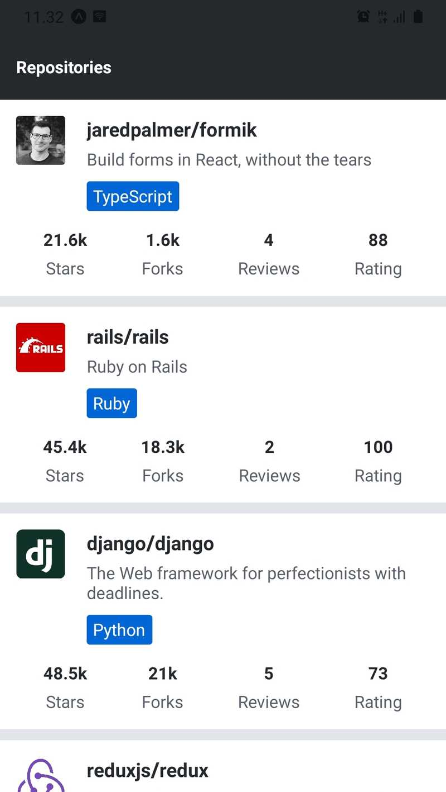
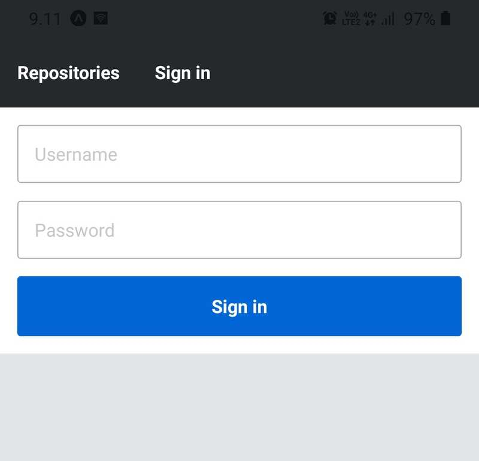
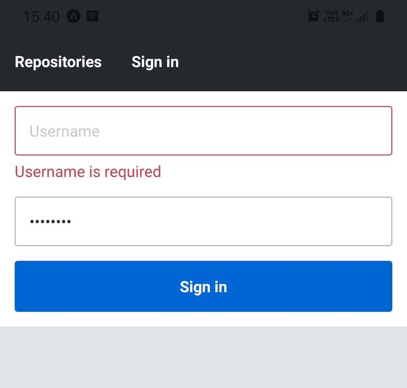

# This repository contains the Full Stack Open course part-10 exercises

All exercises are saved in a separate commit.

## Exercise 10.1: initializing the application

Initialize your application with Expo command-line interface and set up the development environment either using an emulator or Expo's mobile app. It is recommended to try both and find out which development environment is the most suitable for you. The name of the application is not that relevant. You can, for example, go with rate-repository-app.

To submit this exercise and all future exercises you need to [create a new GitHub repository](https://github.com/new). The name of the repository can be for example the name of the application you initialized with expo init. If you decide to create a private repository, add GitHub user [mluukkai](https://github.com/mluukkai) as a [repository collaborator](https://docs.github.com/en/account-and-profile/setting-up-and-managing-your-personal-account-on-github/managing-access-to-your-personal-repositories/inviting-collaborators-to-a-personal-repository). The collaborator status is only used for verifying your submissions.

Now that the repository is created, run `git init` within your application's root directory to make sure that the directory is initialized as a Git repository. Next, to add the created repository as the remote run `git remote add origin git@github.com:<YOURGITHUBUSERNAME>/<NAMEOFYOUR_REPOSITORY>.git` (remember to replace the placeholder values in the command). Finally, just commit and push your changes into the repository and you are all done.

## Exercise 10.2: setting up the ESLint

Set up ESLint in your project so that you can perform linter checks by running `npm run lint`. To get most of linting it is also recommended to integrate ESLint with your editor.

## Exercise 10.3: the reviewed repositories list

In this exercise, we will implement the first version of the reviewed repositories list. The list should contain the repository's full name, description, language, number of forks, number of stars, rating average and number of reviews. Luckily React Native provides a handy component for displaying a list of data, which is the [FlatList](https://reactnative.dev/docs/flatlist) component.

Implement components `RepositoryList` and `RepositoryItem` in the components directory's files _RepositoryList.jsx_ and _RepositoryItem.jsx_. The RepositoryList component should render the `FlatList` component and `RepositoryItem` a single item on the list (hint: use the `FlatList` component's [renderItem](https://reactnative.dev/docs/flatlist#required-renderitem) prop). Use this as the basis for the RepositoryList.jsx file:

```jsx
import { FlatList, View, StyleSheet } from 'react-native';

const styles = StyleSheet.create({
  separator: {
    height: 10,
  },
});

const repositories = [
  {
    id: 'jaredpalmer.formik',
    fullName: 'jaredpalmer/formik',
    description: 'Build forms in React, without the tears',
    language: 'TypeScript',
    forksCount: 1589,
    stargazersCount: 21553,
    ratingAverage: 88,
    reviewCount: 4,
    ownerAvatarUrl: 'https://avatars2.githubusercontent.com/u/4060187?v=4',
  },
  {
    id: 'rails.rails',
    fullName: 'rails/rails',
    description: 'Ruby on Rails',
    language: 'Ruby',
    forksCount: 18349,
    stargazersCount: 45377,
    ratingAverage: 100,
    reviewCount: 2,
    ownerAvatarUrl: 'https://avatars1.githubusercontent.com/u/4223?v=4',
  },
  {
    id: 'django.django',
    fullName: 'django/django',
    description: 'The Web framework for perfectionists with deadlines.',
    language: 'Python',
    forksCount: 21015,
    stargazersCount: 48496,
    ratingAverage: 73,
    reviewCount: 5,
    ownerAvatarUrl: 'https://avatars2.githubusercontent.com/u/27804?v=4',
  },
  {
    id: 'reduxjs.redux',
    fullName: 'reduxjs/redux',
    description: 'Predictable state container for JavaScript apps',
    language: 'TypeScript',
    forksCount: 13902,
    stargazersCount: 52869,
    ratingAverage: 0,
    reviewCount: 0,
    ownerAvatarUrl: 'https://avatars3.githubusercontent.com/u/13142323?v=4',
  },
];

const ItemSeparator = () => <View style={styles.separator} />;

const RepositoryList = () => {
  return (
    <FlatList
      data={repositories}
      ItemSeparatorComponent={ItemSeparator}
      // other props
    />
  );
};

export default RepositoryList;
```

_Do not_ alter the contents of the `repositories` variable, it should contain everything you need to complete this exercise. Render the `RepositoryList` component in the `Main` component which we previously added to the _Main.jsx_ file. The reviewed repository list should roughly look something like this:


## Exercise 10.4: the app bar

We will soon need to navigate between different views in our application. That is why we need an [app bar](https://m2.material.io/components/app-bars-top) to display tabs for switching between different views. Create a file AppBar.jsx in the components folder with the following content:

```jsx
import { View, StyleSheet } from 'react-native';
import Constants from 'expo-constants';

const styles = StyleSheet.create({
  container: {
    paddingTop: Constants.statusBarHeight,
    // ...
  },
  // ...
});

const AppBar = () => {
  return <View style={styles.container}>{/* ... */}</View>;
};

export default AppBar;
```

Now that the `AppBar` component will prevent the status bar from overlapping the content, you can remove the `marginTop` style we added for the `Main` component earlier in the Main.jsx file. The AppBar component should currently contain a tab with the text "`Repositories`". Make the tab [pressable](https://reactnative.dev/docs/pressable) by using the Pressable component but you don't have to handle the `onPress` event in any way. Add the `AppBar` component to the Main component so that it is the uppermost component on the screen. The `AppBar` component should look something like this:



## Exercise 10.5: polished reviewed repositories list

The current version of the reviewed repositories list looks quite grim. Modify the _RepositoryItem_ component so that it also displays the repository author's avatar image. You can implement this by using the [Image](https://reactnative.dev/docs/image) component. Counts, such as the number of stars and forks, larger than or equal to 1000 should be displayed in thousands with the precision of one decimal and with a "k" suffix. This means that for example fork count of 8439 should be displayed as "8.4k". Also, polish the overall look of the component so that the reviewed repositories list looks something like this:



In the image, the `Main` component's background color is set to `#e1e4e8` whereas `RepositoryItem` component's background color is set to `white`. The language tag's background color is `#0366d6` which is the value of the `colors.primary` variable in the theme configuration. Remember to exploit the `Text` component we implemented earlier. Also when needed, split the `RepositoryItem` component into smaller components.

## Exercise 10.6: the sign-in view

We will soon implement a form, that a user can use to _sign in_ to our application. Before that, we must implement a view that can be accessed from the app bar. Create a file _SignIn.jsx_ in the components directory with the following content:

```jsx
import Text from './Text';

const SignIn = () => {
  return <Text>The sign-in view</Text>;
};

export default SignIn;
```

Set up a route for this `SignIn` component in the Main component. Also, add a tab with the text "Sign in" to the app bar next to the "Repositories" tab. Users should be able to navigate between the two views by pressing the tabs (hint: you can use the React router's [Link](https://reactrouter.com/en/6.4.5/components/link-native) component).

## Exercise 10.7: scrollable app bar

As we are adding more tabs to our app bar, it is a good idea to allow horizontal scrolling once the tabs won't fit the screen. The [ScrollView](https://reactnative.dev/docs/scrollview) component is just the right component for the job.

Wrap the tabs in the AppBar component's tabs with a `ScrollView` component:

```jsx
const AppBar = () => {
  return (
    <View style={styles.container}>
      <ScrollView horizontal>{/* ... */}</ScrollView>
    </View>
  );
};
```

Setting the [horizontal](https://reactnative.dev/docs/scrollview#horizontal) prop true will cause the `ScrollView` component to scroll horizontally once the content won't fit the screen. Note that, you will need to add suitable style properties to the `ScrollView` component so that the tabs will be laid in a row inside the flex container. You can make sure that the app bar can be scrolled horizontally by adding tabs until the last tab won't fit the screen. Just remember to remove the extra tabs once the app bar is working as intended.

## Exercise 10.8: the sign-in form

Implement a sign-in form to the `SignIn` component we added earlier in the _SignIn.jsx_ file. The sign-in form should include two text fields, one for the username and one for the password. There should also be a button for submitting the form. You don't need to implement an `onSubmit` callback function, it is enough that the form values are logged using `console.log` when the form is submitted:

```jsx
const onSubmit = values => {
  console.log(values);
};
```

The first step is to install Formik:

```bash
npm install formik
```

You can use the [secureTextEntry](https://reactnative.dev/docs/textinput#securetextentry) prop in the TextInput component to obscure the password input.

The sign-in form should look something like this:



## Exercise 10.9: validating the sign-in form

Validate the sign-in form so that both username and password fields are required. Note that the onSubmit callback implemented in the previous exercise, _should not be called_ if the form validation fails.

The current implementation of the `TextInput` component should display an error message if a touched field has an error. Emphasize this error message by giving it a red color.

On top of the red error message, give an invalid field a visual indication of an error by giving it a red border color. Remember that if a field has an error, the `TextInput` component sets the `TextInput` component's `error` prop as `true`. You can use the value of the `error` prop to attach conditional styles to the `TextInput` component.

Here's what the sign-in form should roughly look like with an invalid field:



The red color used in this implementation is `#d73a4a`.

## Exercise 10.10: a platform-specific font

Currently, the font family of our application is set to `System` in the theme configuration located in the `theme.js` file. Instead of the `System` font, use a platform-specific [Sans-serif](https://en.wikipedia.org/wiki/Sans-serif) font. On the Android platform, use the `Roboto` font and on the iOS platform, use the `Arial` font. The default font can be `System`.

## Exercise 10.11: fetching repositories with Apollo Client

We want to replace the Fetch API implementation in the `useRepositories` hook with a GraphQL query. Open the Apollo Sandbox at <http://localhost:4000> and take a look at the documentation next to the operations editor. Look up the `repositories` query. The query has some arguments, however, all of these are optional so you don't need to specify them. In the Apollo Sandbox form a query for fetching the repositories with the fields you are currently displaying in the application. The result will be paginated and it contains the up to first 30 results by default. For now, you can ignore the pagination entirely.

Once the query is working in the Apollo Sandbox, use it to replace the Fetch API implementation in the `useRepositories` hook. This can be achieved using the [useQuery hook](https://www.apollographql.com/docs/react/api/react/hooks/#usequery). The gql template literal tag can be imported from the _@apollo/client_ library as instructed earlier. Consider using the structure recommended earlier for the GraphQL related code. To avoid future caching issues, use the cache-and-network [fetch policy](https://www.apollographql.com/docs/react/data/queries/#setting-a-fetch-policy) in the query. It can be used with the `useQuery` hook like this:

```jsx
useQuery(MY_QUERY, {
  fetchPolicy: 'cache-and-network',
  // Other options
});
```

The changes in the `useRepositories` hook should not affect the `RepositoryList` component in any way.

## Exercise 10.12: environment variables

Instead of the hardcoded Apollo Server's URL, use an environment variable defined in the .env file when initializing the Apollo Client. You can name the environment variable for example `APOLLO_URI`.

Do not try to access environment variables like `process.env.APOLLO_URI` outside the _app.config.js_ file. Instead use the `Constants.expoConfig.extra` object like in the previous example. In addition, do not import the dotenv library outside the _app.config.js_ file or you will most likely face errors.

## Exercise 10.13: the sign in form mutation

The current implementation of the sign in form doesn't do much with the submitted user's credentials. Let's do something about that in this exercise. First, read the rate-repository-api server's [authentication documentation](https://github.com/fullstack-hy2020/rate-repository-api#-authentication) and test the provided queries and mutations in the Apollo Sandbox. If the database doesn't have any users, you can populate the database with some seed data. Instructions for this can be found in the [getting started](https://github.com/fullstack-hy2020/rate-repository-api#-getting-started) section of the README.

Once you have figured out how the authentication works, create a file `useSignIn.js` file in the _hooks_ directory. In that file implement a `useSignIn` hook that sends the authenticate mutation using the [useMutation](https://www.apollographql.com/docs/react/api/react/hooks/#usemutation) hook. Note that the authenticate mutation has a single argument called `credentials`, which is of type `AuthenticateInput`. This [input type](https://graphql.org/graphql-js/mutations-and-input-types/) contains `username` and `password` fields.

The return value of the hook should be a tuple `[signIn, result]` where `result` is the mutations result as it is returned by the `useMutation` hook and `signIn` a function that runs the mutation with a `{ username, password }` object argument. Hint: don't pass the mutation function to the return value directly. Instead, return a function that calls the mutation function like this:

```jsx
const useSignIn = () => {
  const [mutate, result] = useMutation(/* mutation arguments */);

  const signIn = async ({ username, password }) => {
    // call the mutate function here with the right arguments
  };

  return [signIn, result];
};
```

Once the hook is implemented, use it in the `SignIn` component's `onSubmit` callback for example like this:

```jsx
const SignIn = () => {
  const [signIn] = useSignIn();

  const onSubmit = async values => {
    const { username, password } = values;

    try {
      const { data } = await signIn({ username, password });
      console.log(data);
    } catch (e) {
      console.log(e);
    }
  };

  // ...
};
```

This exercise is completed once you can log the user's _authenticate_ mutations result after the sign in form has been submitted. The mutation result should contain the user's access token.
